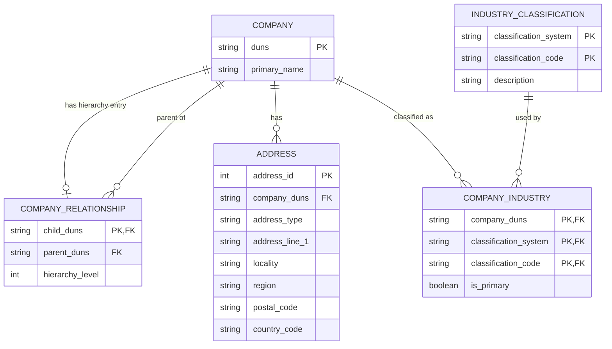

# Efficio Data Engineering Technical Task

This repository contains the Python solution for the Efficio Data Engineering Technical Task.

The implementation ingests detailed company data and corporate family-tree data, validates the source files, enriches each detailed company record with hierarchy information, performs output data-quality checks, and writes the resulting analytical dataset to Parquet.

The solution is intentionally lightweight. The goal is to demonstrate a clear, testable, maintainable data-engineering approach without introducing infrastructure that is unnecessary for the supplied dataset.

## Approach

The pipeline processes the supplied company datasets using the following flow:

```text
Data_blocks.json
        |
        v
Load and validate detailed company record
        |
        +----------------------+
                               |
Family_tree.json               |
        |                      |
        v                      |
Load and validate hierarchy    |
        |                      |
        v                      |
Build DUNS hierarchy lookup    |
        |                      |
        +-----------+----------+
                    |
                    v
            Enrich company record
                    |
                    v
           Data-quality checks
                    |
                    v
               Parquet output
```

DUNS is used as the company identifier shared by the detailed company data and the family-tree data. DUNS values are handled as strings so that leading zeroes are preserved.

The enrichment uses left-join semantics: the detailed company record remains in the output even when no matching hierarchy record is available. In that case, hierarchy fields are returned as null rather than dropping the company.

## Project Structure

```text
efficio-data-engineering-takehome/
├── .github/
│   └── workflows/
│       └── ci.yml
├── data/                       # confidential input data; not committed
│   ├── company_a/
│   ├── company_b/
│   └── company_c/
├── docs/
│   ├── data_model.md
│   └── requirements_and_assumptions.md
├── output/                     # generated output; not committed
├── src/
│   ├── __init__.py
│   ├── pipeline.py
│   └── profile_data.py
├── tests/
│   └── test_pipeline.py
├── pytest.ini
├── requirements.txt
└── README.md
```

Each company directory is expected to contain two source files:

```text
data/company_a/
├── data_blocks.json
└── family_tree.json
```

The same structure is used for `company_b` and `company_c`.

## Setup

Python 3.11 is used for this project and by the GitHub Actions workflow.

### Standard reviewer setup

From the repository root, create a virtual environment:

```powershell
python -m venv .venv
```

Activate it in Windows PowerShell:

```powershell
.\.venv\Scripts\Activate.ps1
```

Install the dependencies:

```powershell
python -m pip install -r requirements.txt
```

### Development environment used for the take-home

The solution was developed locally using `uv` with a virtual environment named `efficio_venv`.

Create that environment with:

```powershell
uv venv efficio_venv --python 3.11
```

Activate it in Windows PowerShell:

```powershell
.\efficio_venv\Scripts\Activate.ps1
```

Install the same committed dependencies:

```powershell
python -m pip install -r requirements.txt
```

`uv` is not required to review or run the submitted solution; `requirements.txt` is the dependency specification used by both the standard setup and CI.

## Dependencies

The implementation uses:

- `pandas` for constructing the analytical output DataFrame
- `pyarrow` as the Parquet engine
- `pytest` for the requested unit test

Exact versions are pinned in `requirements.txt`.

## Running the Pipeline

From the repository root, with the environment activated:

```powershell
python src/pipeline.py
```

The pipeline processes `company_a`, `company_b`, and `company_c`, then writes:

```text
output/company_enriched.parquet
```

The `output` directory is created automatically if it does not already exist.

The script logs processing and validation activity and prints the final DataFrame after a successful run.

## Output Schema

The Parquet output contains one enriched record for each supplied detailed company dataset.

| Column | Description |
|---|---|
| `Company_ID` | Company DUNS identifier from `data_blocks.json` |
| `Company_Name` | Primary company name |
| `Parent_Company_ID` | Direct parent DUNS from the family tree; null for a root or unmatched company |
| `Hierarchy_Level` | Hierarchy level from `corporateLinkage` |
| `Global_Ultimate_ID` | Global ultimate DUNS from the family-tree response |
| `Source_Company` | Source company directory name for traceability |

For the supplied detailed records, a null `Parent_Company_ID` can be valid business data when the detailed company is the root/global-ultimate company. A null value can also occur when no matching hierarchy entry is available; the pipeline preserves the detailed record in either case.

## Input Validation and Error Handling

The production pipeline validates conditions that would make processing unreliable or ambiguous.

It handles or checks for:

- missing required input files
- malformed JSON
- unexpected top-level JSON structures
- missing required DUNS identifiers
- blank required DUNS identifiers
- malformed family-tree member entries
- family-tree members with missing DUNS values
- duplicate DUNS values within a returned hierarchy
- parent references that are not present in the returned family-tree members
- output row-count preservation
- missing output company identifiers
- duplicate output company identifiers

Missing files, malformed JSON, invalid top-level structures, missing or blank required company DUNS values, duplicate hierarchy DUNS values, and failed output checks raise exceptions.

Malformed optional family-tree members and unresolved parent references are surfaced through logging so that incomplete hierarchy information does not automatically remove the detailed company record.

## Logging

The pipeline uses Python's standard `logging` module.

Logging is used to report:

- each company folder being processed
- malformed or incomplete family-tree records
- unresolved parent references
- successful data-quality validation
- successful Parquet output creation
- unexpected pipeline failures with stack traces

The top-level pipeline catches unexpected exceptions only to log the failure and then re-raises them so the process still exits unsuccessfully. This behavior is useful both locally and in automated execution.

## Profiling Utility

`src/profile_data.py` is a lightweight development/profiling utility used to inspect hierarchy characteristics in the supplied datasets.

It reports information such as:

- detailed company DUNS and company name
- global-ultimate DUNS
- reported and returned family-tree member counts
- missing, unique, and duplicate family-tree DUNS values
- hierarchy levels present
- members with and without direct parents
- unresolved parent references

The script currently profiles Companies B and C and is protected by a standard `if __name__ == "__main__":` guard so importing the module does not automatically execute the profiling routine.

Run it from the repository root with:

```powershell
python src/profile_data.py
```

## Relational Data Model

The proposed logical relational model separates core company information, hierarchy relationships, addresses, and industry classifications to reduce redundancy while supporting efficient querying.

The hierarchy uses an adjacency-list design: each hierarchy entry stores the direct parent relationship rather than creating fixed parent, grandparent, and great-grandparent columns. This supports arbitrary hierarchy depth in a relational model.



Additional modeling details are documented in [`docs/data_model.md`](docs/data_model.md).

## Testing

The technical task requests one pytest unit test for the join/enrichment transformation.

Run the test with:

```powershell
python -m pytest -q
```

The synthetic test directly exercises `enrich_company_record()` and verifies two behaviors within the single requested test:

- a matching child company receives the expected direct parent, hierarchy level, and global-ultimate identifier
- a company without a matching hierarchy member is still retained with null parent and hierarchy values

Synthetic data keeps the unit test deterministic and allows the test suite and CI workflow to run without access to the confidential source JSON files.

## Continuous Integration

GitHub Actions runs the pytest suite automatically on pushes and pull requests.

The workflow is defined in:

```text
.github/workflows/ci.yml
```

The current CI workflow:

1. checks out the repository
2. configures Python 3.11
3. installs dependencies from `requirements.txt`
4. runs `python -m pytest -q`

The confidential input data is not committed, so CI intentionally validates the transformation through the synthetic unit test rather than running the full source-data pipeline.

## Design Decisions and Trade-offs

### DUNS as the join key

DUNS is present in both source structures and is used as the common company identifier for enrichment.

It is normalized to a stripped string before use so that leading zeroes are not lost and accidental surrounding whitespace does not create mismatches.

### Dictionary lookup for hierarchy enrichment

The family-tree members are converted into a dictionary keyed by DUNS before enrichment.

This makes the final company lookup direct and avoids repeatedly scanning the full family-tree member list for the detailed company record.

### Left-join semantics

The detailed company record is treated as the record that must be preserved. Missing hierarchy information therefore produces null hierarchy fields instead of removing the company from the analytical output.

This makes incomplete optional hierarchy data visible without treating it as equivalent to a missing required company identifier.

### pandas

`pandas` is used to assemble the supplied enriched records into the final analytical DataFrame.

For the supplied number of company datasets, this keeps the implementation small and readable. A distributed processing framework would add operational complexity without providing a practical benefit at the current scale.

### PyArrow and Parquet

The DataFrame is written with the `pyarrow` Parquet engine.

Parquet is appropriate for analytical output because it provides typed, columnar storage and supports compressed, efficient downstream reads.

### Logical relational schema vs. analytical output

The ERD represents a normalized logical relational design for storing the broader company data model.

The submitted Parquet file is intentionally much narrower and denormalized because the task's processing deliverable is an enriched analytical output rather than a deployed transactional database.

A physical relational database is therefore not created by the Python application; the relational design is documented through the ERD and supporting documentation.

## Scaling to Larger Datasets

The current implementation is deliberately appropriate for the supplied data. If the JSON inputs or number of companies became significantly larger, two code-level changes would improve scalability without requiring an infrastructure change.

### 1. Stream large JSON inputs

The current `load_json()` implementation uses `json.load()`, which materializes each complete JSON file in memory.

For significantly larger family-tree files, a streaming parser such as `ijson` could process `familyTreeMembers` incrementally instead of loading the entire source document at once.

This would reduce peak memory consumption while preserving the same overall ingestion and enrichment architecture.

### 2. Process and write records in batches

The current pipeline builds all enriched records in a Python list, converts the complete list into one pandas DataFrame, and then writes the Parquet file.

For a much larger number of company datasets, records could be accumulated in bounded batches and written incrementally with `pyarrow.parquet.ParquetWriter`.

This would prevent memory usage from growing linearly with the total number of companies while retaining the same Python and Parquet-based solution.

## Confidentiality and Version Control

The supplied raw JSON files are confidential and are excluded from version control through `.gitignore`.

Generated Parquet output is also excluded from Git.

The repository therefore contains the implementation, tests, documentation, dependency specification, and CI configuration without committing the confidential source data or generated analytical output.
