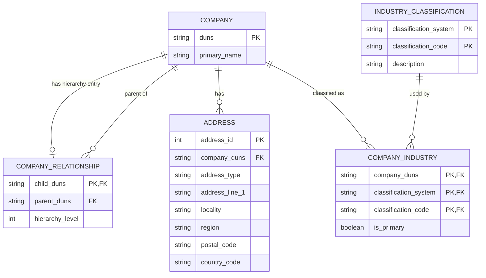

# Efficio Data Engineering Technical Task
Data Engineering Technical Task

This repository contains a Python data-processing pipeline for the Efficio Data Engineering Technical Task.

The solution ingests detailed company data and family-tree hierarchy data, validates the inputs, enriches each detailed company record with hierarchy information, performs data-quality checks, and writes the resulting analytical dataset to Parquet.

The implementation is intentionally lightweight and focuses on correctness, clarity, testability, and maintainability rather than introducing unnecessary infrastructure.

## Approach

The pipeline processes each supplied company dataset using the following flow:

```text
Data_blocks.json
        |
        v
Load and validate detailed company
        |
        +--------------------+
                             |
Family_tree.json             |
        |                    |
        v                    |
Load and validate hierarchy  |
        |                    |
        v                    |
Build DUNS hierarchy lookup  |
        |                    |
        +----------+---------+
                   |
                   v
           Enrich company record
                   |
                   v
          Data-quality checks
                   |
                   v
              Parquet output
```

DUNS is used as the canonical company identifier. It is treated as a string rather than a number so that leading zeroes are preserved.

The enrichment follows left-join semantics: the detailed company record is retained even when hierarchy information is unavailable.

## Project Structure

```text
efficio-data-engineering-takehome/
├── .github/
│   └── workflows/
│       └── ci.yml
├── data/                       # confidential input data; not committed
│   ├── company_a/
│   ├── company_b/
│   └── company_c/
├── docs/
│   ├── data_model.md
│   └── requirements_and_assumptions.md
├── output/                     # generated output; not committed
├── src/
│   ├── __init__.py
│   ├── pipeline.py
│   └── profile_data.py
├── tests/
│   └── test_pipeline.py
├── pytest.ini
├── requirements.txt
└── README.md
```

Each company folder is expected to contain:

```text
data/company_a/
├── data_blocks.json
└── family_tree.json
```

The same structure is used for `company_b` and `company_c`.

## Setup

Python 3.11 is recommended.

Create and activate a virtual environment:

```bash
python -m venv .venv
```

Windows PowerShell:

```powershell
.\.venv\Scripts\Activate.ps1
```

Install the dependencies:

```bash
pip install -r requirements.txt
```

## Running the Pipeline

From the repository root:

```bash
python src/pipeline.py
```

The pipeline writes:

```text
output/company_enriched.parquet
```

The output directory is created automatically if it does not already exist.

## Output Schema

The Parquet output contains one row per supplied detailed company record.

| Column | Description |
|---|---|
| `Company_ID` | Company DUNS identifier |
| `Company_Name` | Primary company name |
| `Parent_Company_ID` | Direct parent DUNS, null for a root or unmatched company |
| `Hierarchy_Level` | Company hierarchy level from the family-tree data |
| `Global_Ultimate_ID` | Global ultimate company DUNS |
| `Source_Company` | Source company folder used for traceability |

The supplied detailed records are global-ultimate/root companies, so a null `Parent_Company_ID` is valid business data rather than automatically indicating an error.

## Validation and Error Handling

The pipeline includes validation and data-quality checks for:

- missing input files
- malformed JSON
- unexpected top-level JSON structures
- missing or blank required DUNS identifiers
- malformed family-tree members
- duplicate DUNS values within the returned hierarchy
- unresolved parent references
- output row-count preservation
- missing output company identifiers
- duplicate output company identifiers

Fatal conditions raise clear exceptions.

Optional or incomplete hierarchy information is handled without dropping the detailed company record. Unresolved hierarchy relationships are surfaced through logging.

## Logging

Python's standard `logging` module is used to report:

- each company being processed
- hierarchy-related warnings
- successful data-quality checks
- Parquet output creation
- unexpected pipeline failures

## Relational Data Model

The proposed relational model separates company attributes, hierarchical relationships, addresses, and industry classifications to minimize redundancy.

The hierarchy uses an adjacency-list design: a company stores its direct parent relationship rather than fixed parent/grandparent/great-grandparent columns. This allows the model to support hierarchies of arbitrary depth.



Additional modeling details are documented in [`docs/data_model.md`](docs/data_model.md).

## Testing

The task requests a single pytest unit test for the join/enrichment transformation.

Run it with:

```bash
python -m pytest -q
```

The synthetic test verifies that:

- a child company receives the correct direct parent and hierarchy level
- a company without a hierarchy match is still retained with null hierarchy values

Synthetic data is used so that the test and CI pipeline do not depend on confidential source files.

## Continuous Integration

GitHub Actions runs the pytest suite automatically on pushes and pull requests.

The workflow is defined in:

```text
.github/workflows/ci.yml
```

The confidential input JSON files are intentionally excluded from Git, so CI validates the transformation using the synthetic unit test rather than executing the full production-data pipeline.

## Design Decisions and Trade-offs

### pandas

pandas was selected because the supplied datasets fit comfortably in memory and it keeps the solution easy to understand and maintain.

A distributed processing framework would add unnecessary operational complexity for the current data volume.

### PyArrow / Parquet

PyArrow is used for Parquet output. Parquet provides:

- typed columnar storage
- compression
- efficient analytical reads
- column pruning support

### Logical schema vs analytical output

The ERD represents a normalized logical relational design.

The Parquet output is intentionally denormalized because its purpose is analytical consumption rather than transactional storage.

A physical relational database was not deployed because the task asks for schema design and an ERD rather than database infrastructure.

## Scaling to Larger Datasets

The current implementation is appropriate for the supplied data, but two concrete code-level changes would improve scalability if the JSON files or number of companies became significantly larger without requiring an infrastructure change.

### 1. Stream JSON instead of loading complete files into memory

`json.load()` currently materializes each source file in memory.

For much larger files, the loader could be replaced with a streaming JSON parser such as `ijson`. Family-tree members could then be processed incrementally rather than loading the entire hierarchy at once.

This would reduce peak memory usage while preserving the same pipeline architecture.

### 2. Write Parquet incrementally

The current pipeline builds the complete pandas DataFrame before writing it.

For a much larger number of companies, records could instead be processed in batches and written incrementally using `pyarrow.parquet.ParquetWriter`.

This would bound memory usage while retaining the same Python and Parquet-based solution and would not require additional infrastructure.

## Confidentiality

The supplied raw JSON files are confidential and therefore excluded from version control.

Generated Parquet output is also excluded from Git.

Only source code, documentation, tests, and CI configuration are committed.****
