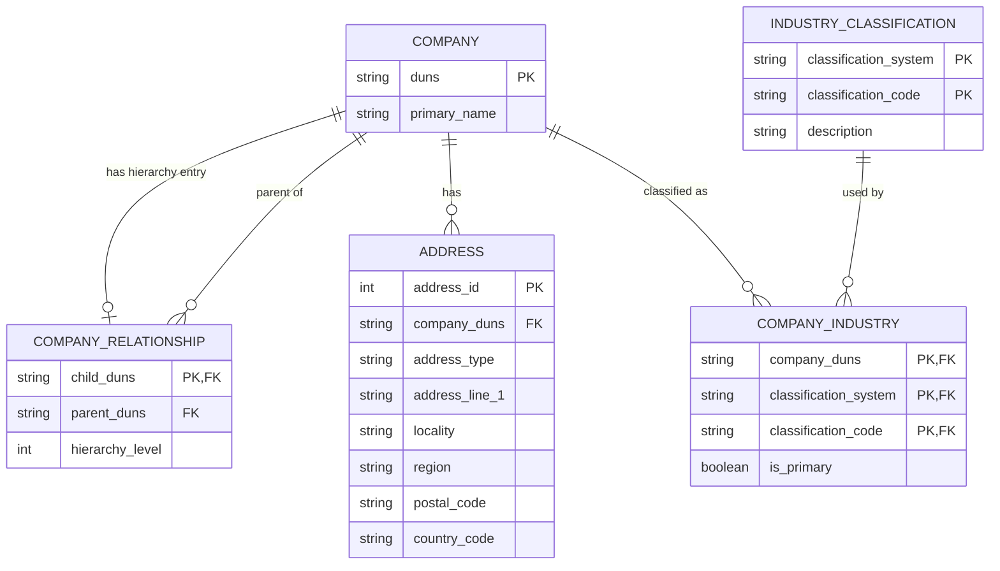

# efficio-data-engineering-takehome
Data Engineering Technical Task

```mermaid
erDiagram
    COMPANY {
        string duns PK
        string primary_name
    }

    COMPANY_RELATIONSHIP {
        string child_duns PK, FK
        string parent_duns FK
        int hierarchy_level
    }

    ADDRESS {
        int address_id PK
        string company_duns FK
        string address_type
        string address_line_1
        string locality
        string region
        string postal_code
        string country_code
    }

    INDUSTRY_CLASSIFICATION {
        string classification_system PK
        string classification_code PK
        string description
    }

    COMPANY_INDUSTRY {
        string company_duns PK, FK
        string classification_system PK, FK
        string classification_code PK, FK
        boolean is_primary
    }

    COMPANY ||--o| COMPANY_RELATIONSHIP : "has hierarchy entry"
    COMPANY ||--o{ ADDRESS : "has"
    COMPANY ||--o{ COMPANY_INDUSTRY : "classified as"
    INDUSTRY_CLASSIFICATION ||--o{ COMPANY_INDUSTRY : "used by"
    COMPANY ||--o{ COMPANY_RELATIONSHIP : "parent of"
```
