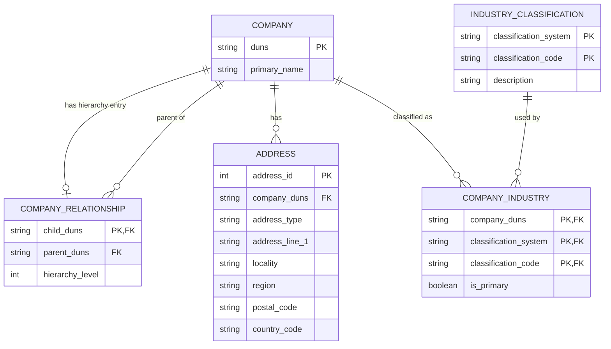

# Relational Data Model

## Design Approach

The supplied company data contains detailed company attributes as well as
hierarchical parent-subsidiary relationships.

Profiling of the supplied datasets showed that:

- DUNS is present and unique within each returned family-tree dataset.
- DUNS must be stored as a string so leading zeroes are preserved.
- Each returned company has zero or one direct parent.
- Root/global-ultimate companies legitimately have no parent.
- Hierarchies can be deep; the supplied data reaches at least 11 levels.
- Source-reported family-member counts do not necessarily equal the number
  of family-tree records returned in the JSON response.

The model therefore uses an adjacency-list relationship for the company
hierarchy rather than fixed hierarchy-level columns.

## Entity-Relationship Diagram

## Keys and Relationships

### COMPANY

`duns` is the primary key and canonical company identifier.

DUNS is stored as a string because identifiers may contain leading zeroes.

### COMPANY_RELATIONSHIP

`child_duns` is the primary key because profiling indicates that a company
has at most one direct parent in the supplied hierarchy.

`child_duns` references `COMPANY.duns`.

`parent_duns` also references `COMPANY.duns` and is nullable for root
companies.

This adjacency-list structure supports hierarchies of arbitrary depth using
recursive queries without storing redundant parent, grandparent, and
great-grandparent columns.

### ADDRESS

Addresses are separated from the company record because a company can have
multiple address records or address types.

### INDUSTRY_CLASSIFICATION

Classification codes and their descriptions are stored once rather than
repeated for every company.

### COMPANY_INDUSTRY

This bridge table supports the many-to-many relationship between companies
and industry classifications.

## Analytical Output

The relational schema above represents the proposed normalized logical
database design.

The processing pipeline will produce a separate denormalized Parquet
dataset optimized for analytical consumption. Its grain will be one row
per supplied detailed company record, enriched with hierarchy attributes
such as `Parent_Company_ID`.

A left join will be used so that a company is preserved even when hierarchy
information is unavailable. A null `Parent_Company_ID` is valid for a
root/global-ultimate company and should not automatically be treated as a
data-quality failure.